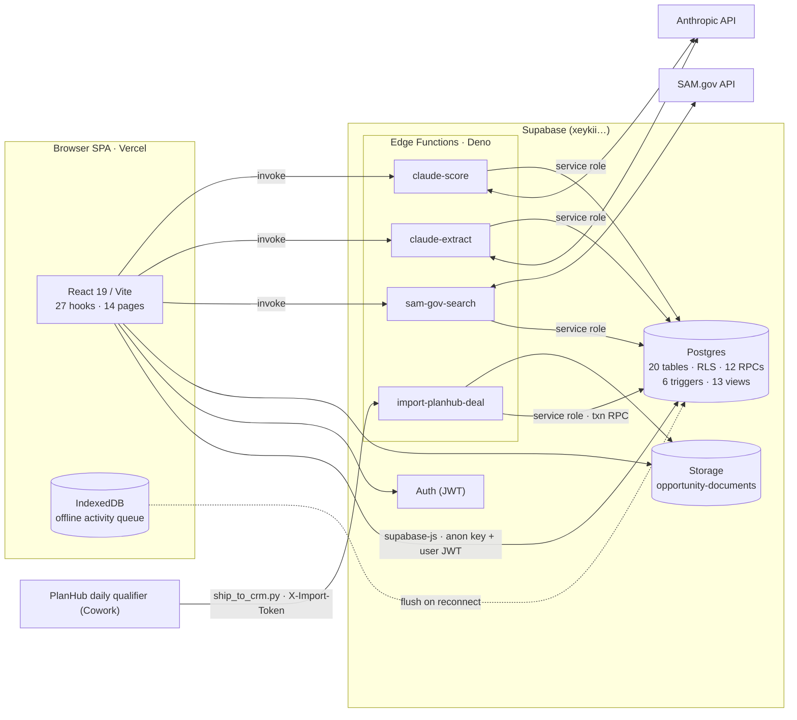

# Coatings CRM — Architecture

A single-tenant sales CRM for a commercial flooring & coatings contractor (Motor City Floors,
Metro Detroit). Four bid "motions" — **public bid, GC chase, facility, and federal/GovCon** — flow
through one opportunity model with pipeline-specific extension tables, a Postgres-enforced stage
machine, and three external ingest paths (SAM.gov, Claude, PlanHub).

> Generated from live DB introspection at migration **00078**. Keep in sync with `CLAUDE.md`
> (invariants & dev workflow) and `src/lib/database.types.ts` (generated types).

- **Frontend:** React 19 · Vite 8 · TypeScript (strict, no `any`) · Tailwind 4 · react-router 7 ·
  @dnd-kit (kanban DnD) · Recharts · PWA + IndexedDB offline queue (idb)
- **Backend:** Supabase — Postgres (RLS everywhere) · Auth · Storage · 4 Deno Edge Functions
- **Hosting:** Vercel deploys the SPA from `master`; DB via `supabase db push` (ref `xeykiicwwemecwyzmqgy`)
- **Scale:** ~14.3k LOC · 78 tests · 78 migrations

---

## 1. Shape & data flow

The whole app is a **browser SPA talking to hosted Supabase** — there is no bespoke backend server.
Anything the browser can't do (call a third-party API with a server secret, run a multi-table
transaction, bypass RLS for a cross-owner check) is a Postgres `plpgsql` function or a Deno Edge
Function. Business rules are enforced in the DB (CHECK constraints, RLS, guard triggers, SECURITY
DEFINER RPCs) and **mirrored** in the client for instant feedback.



---

## 2. Auth & RLS

The browser authenticates with Supabase Auth and carries a user JWT on every request; **RLS is the
authorization layer**. Roles come from `user_profiles.role` (`app_role`: `rep · owner · admin`),
resolved server-side by the SECURITY DEFINER helper `current_app_role()`. Recurring policy shape:

- **rep** — full CRUD on rows they own (`opportunities.owner_id = auth.uid()`)
- **owner** — read-all via `current_app_role() = 'owner'`
- **admin** — unrestricted (`ALL`)

Child/extension tables (`bids`, `federal_details`, `competitor_bids`, `opportunity_documents`, …)
store no owner — their policies **derive** access from the parent opportunity via an `EXISTS`
subquery. Edge Functions use the `service_role` key and bypass RLS deliberately (the SAM.gov
cross-owner dedup check; the PlanHub transactional import running as a designated owner).

> A signed-in user with **no `user_profiles` row** resolves to `current_app_role() = null` and is
> invisible to owner/admin policies — the account sees nothing until a profile row exists.

The browser holds only the **publishable (anon) key**. The `service_role` key never touches the
client — it exists only inside Edge Functions as an env secret.

---

## 3. Data model

20 base tables + 13 views. `opportunities` is the hub; the rest are its extensions, children, or
operational logs.

### `opportunities` — the hub

One row per pursued job. `pipeline` is an enum; `stage` is **text** gated by a CHECK; `status` is the
terminal-outcome enum (decoupled from stage — see §8). `amount` is **our bid**, not the project value.

| column | type | notes |
|---|---|---|
| `id` | uuid | PK |
| `name` | text NN | project title |
| `pipeline` | pipeline_type NN | bid motion (enum) |
| `stage` | text NN | CHECK `valid_stage_for_pipeline()` |
| `status` | opp_status NN | OPEN·WON·LOST·NURTURE·DISQUALIFIED |
| `amount` | numeric | **our bid**; drives Outstanding-Bid $ |
| `owner_id` | uuid NN | → auth.users; the RLS key |
| `company_id` | uuid NN | → companies |
| `job_site_address` | text NN | + optional `job_site_lat/lng` |
| `win_probability` | numeric | set by `advance_stage` per stage |
| `stage_entered_at` | timestamptz | stage-age / staleness |
| `gross_profit_pct` | numeric | GP gate before close-won |
| `project_tag` | text | source tag, e.g. `PlanHub` |
| _plus_ | | `expected_close_date · priority · next_step(_date) · competitor · prevailing_wage · final_value · completed_at · completion_notes · lost_reason · revisit_date · created_at · updated_at` |

### Pipeline extension tables (1:1, existence-gated)

Each opportunity carries exactly one extension row, keyed by pipeline. Guard triggers reject
wrong-pipeline inserts; the create path inserts opp + extension in one transaction. **PlanHub deals
are `GC_CHASE` and additionally carry a `planhub_details` row.**

| table | for pipeline | carries |
|---|---|---|
| `bids` | PUBLIC_BID · GC_CHASE | `bid_due_at, plans_link, addenda_acknowledged, prebid_walk_*, bond_*, estimate_file_url, go_no_go, invited, low_bid_amount, bid_tab_position, gc_*` — the public/GC gate inputs |
| `facility_details` | FACILITY | `budget_cycle, decision_maker_id, warranty_term, square_footage,` survey/contact/proposal/PO booleans |
| `federal_details` | FEDERAL | ~55 cols: SAM identity (`solicitation_number, sam_notice_id, naics_code, set_aside_type, pop_*`), Claude extraction (`extraction_json/_status`), scoring (`score_*, *_fit, scoring_status`), `estimate_*`, submission tracking |
| `planhub_details` | GC_CHASE (overlay) | `planhub_id` **UNIQUE**, `revision, verdict (BID\|CALL), project_value_usd, square_feet, distance_miles, labor, flooring_scope_summary, imported_at` |

### Children & activity

| table | role |
|---|---|
| `activities` | timeline events & tasks (`type` = CALL·VISIT·PREBID_WALK·EMAIL·NOTE; `next_action`+`next_action_at` model to-dos). Offline-queued. |
| `bid_quotes` | PUBLIC_BID: GCs we sent our number to (`carried_us, gc_won_award`). UNIQUE(opp, gc_company). |
| `competitor_bids` | rival bids on a lost job (`bidder_name, amount, is_winner`). Partial-unique one winner/opp. |
| `opportunity_documents` | Storage metadata (`file_name, storage_path`). UNIQUE(opp, storage_path) → idempotent re-attach. |
| `opportunity_stage_history` | append-only stage transitions, written by `advance_stage` **only** (no trigger). |
| `company_notes` · `contact_notes` | freeform notes; `contact_notes` has a Gmail-sync `source`/`external_id`. |
| `user_pins` | per-user pinned opportunities. |

### Companies · contacts · ops & config

| table | role |
|---|---|
| `companies` | GC/owner/architect/agency (`company_type`). Partial-unique on `lower(email)` — the PlanHub upsert key. Soft-archive. |
| `contacts` | people at a company (`contact_role`, `phone` NN, `is_decision_maker`, favorite). Soft-archive. |
| `goals` | per-period targets (REVENUE_WON, BIDS_SUBMITTED[_VALUE], WALKS_ATTENDED, OPPS_SOURCED, PROPOSALS_SENT). |
| `user_profiles` | role + name; the RBAC source (`current_app_role()`). |
| `sam_gov_sync_log` | one row per SAM.gov search run: NAICS, set-asides, results, `requests_used`, errors. |
| `planhub_ship_status` | one row per ship-step run: found/created/updated/skipped/failed + errors. Source of the crm-inbox pending count. |
| `usaspending_cache` | cached federal award pricing intel by NAICS/agency/state. |
| `internal_config` | key/value; holds the Gmail-integration shared secret. |

### Reporting views (13)

Read-only KPI layer over the model:

- **Pipeline & $:** `v_outstanding_bid_dollars`, `v_bond_exposure`, `v_bid_out_awaiting`,
  `v_closing_this_month`, `v_weighted_forecast_90d`, `v_spread_to_low`
- **Win/loss:** `v_win_rate_by_motion`, `v_closed_won_vs_goal`, `v_customer_concentration`
- **Hygiene:** `v_stale_leaks` (no activity 14d / missing next-step)
- **Accounts:** `v_company_list`, `v_company_kpis`

> **Load-bearing:** views filtering on stage literals (`v_outstanding_bid_dollars`, `v_bond_exposure`,
> `v_bid_out_awaiting`) were rewritten in 00076 for the new stage set. Outstanding Bid $ now begins at
> `BIDDING` (BIDDING·ESTIMATED·SUBMITTED·GC_AWARDED). `v_spread_to_low` still reads
> `bids.low_bid_amount`, which overlaps `competitor_bids` — a known duplication.

---

## 4. Enums

| type | values |
|---|---|
| `pipeline_type` | PUBLIC_BID · GC_CHASE · FACILITY · FEDERAL |
| `opp_status` | OPEN · WON · LOST · NURTURE · DISQUALIFIED |
| `app_role` | rep · owner · admin |
| `company_type` | GC · AWARDING_AUTHORITY · OWNER · ARCHITECT · GOVERNMENT_AGENCY |
| `contact_role` | PM · ESTIMATOR · SUPER · FM · PURCHASING · SPEC_WRITER |
| `activity_type` | CALL · VISIT · PREBID_WALK · EMAIL · NOTE |

`stage` is deliberately **not** an enum — it's `text` + a CHECK function so per-pipeline sets can
evolve without a type migration.

---

## 5. Stage machine

Stage is a per-pipeline string validated by `valid_stage_for_pipeline(pipeline, stage)` (IMMUTABLE,
behind the `chk_stage_in_pipeline` CHECK). Current sets (post-00076):

```
PUBLIC_BID  SOURCED → BIDDING → ESTIMATED → SUBMITTED → AWARDED | LOST
GC_CHASE    QUALIFIED → BIDDING → ESTIMATED → SUBMITTED → GC_AWARDED → WON | LOST
FACILITY    ENGAGED → SITE_WALK → PROPOSAL → APPROVAL → WON | LOST
FEDERAL     INTAKE → EXTRACTION → SCORING → ESTIMATING → SUBMITTED → AWARDED | LOST
```

`advance_stage(opp, target)` is the state machine (SECURITY DEFINER). It:

1. checks ownership/admin;
2. validates the transition is the next active stage or a legal terminal;
3. runs **pipeline-specific gate predicates** (PUBLIC_BID: plans link → strict readiness at
   ESTIMATED→SUBMITTED → bid-due/GP at close; FEDERAL: extraction/scoring/estimate completeness;
   GC/FACILITY currently ungated);
4. applies the status coupling (see §8);
5. writes `win_probability`;
6. appends to `opportunity_stage_history`.

The same gate logic is mirrored client-side in `src/lib/gates/*` for the instant checklist and drag
validation — **changes must land in both.** Federal gates are server-only (client optimistically
allows; the RPC rejects).

---

## 6. RPC reference

All under `public`, called via `supabase.rpc()` or by Edge Functions. †=SECURITY DEFINER.

| function | signature → returns | purpose |
|---|---|---|
| `create_opportunity` | (name, pipeline, company_id, addr, amount?) → uuid | Insert opp at the pipeline's entry stage + its extension row, in one txn. GC_CHASE entry = QUALIFIED. |
| `advance_stage` † | (opp_id, target_stage) → (id,stage,status) | The stage state machine — validation, gates, status coupling, win-prob, history. |
| `valid_stage_for_pipeline` | (pipeline, stage) → bool | IMMUTABLE; backs the stage CHECK. |
| `delete_opportunity` † | (opp_id) → void | Owner/admin hard delete; cascades bids, quotes, activities, history, docs. |
| `mark_complete` / `undo_complete` † | (opp_id, …) → void | Job-completion lifecycle (final_value, completed_at) with the WON coupling. |
| `import_federal_opportunity` | (title, agency, solicitation#, …18 args) → uuid | Find-or-create agency company + FEDERAL opp + federal_details. Used by sam-gov-search import. |
| `import_planhub_deal` † | (payload jsonb, owner) → (status,opp,rev) | Transactional PlanHub ingest; revision-gated created/updated/skipped across opp+bids+planhub_details+company/contact+task. |
| `set_competitor_bid_winner` | (bid_id) → void | Atomic winner swap (clears prior winner) so the one-winner index never sees two. |
| `current_app_role` † | () → text | Resolves the caller's role from user_profiles — used across RLS policies. |
| `find_contacts_by_email` · `log_gmail_contact_note` † | (secret, …) → … | Gmail integration; gated by a shared secret in `internal_config` (not a user JWT). |

---

## 7. Edge Functions (Deno)

| function | secret(s) | role |
|---|---|---|
| `sam-gov-search` | `SAM_GOV_API_KEY` | Runs the standing NAICS/set-aside query set against SAM.gov v2, dedups, returns a preview; a second action imports via `import_federal_opportunity`. Logs to `sam_gov_sync_log`. 360-day window (under the 1-yr limit). |
| `claude-extract` | `ANTHROPIC_API_KEY` | Structured-output extraction of a federal solicitation into `federal_details`. Status PENDING→PROCESSING→COMPLETE; INTAKE→EXTRACTION gate requires COMPLETE. |
| `claude-score` | `ANTHROPIC_API_KEY` | Scores an extracted federal opp BID/WATCH/PASS vs. the company profile. Requires extraction COMPLETE; drives EXTRACTION→SCORING. |
| `import-planhub-deal` | `PLANHUB_IMPORT_TOKEN`, `PLANHUB_IMPORT_OWNER_ID` | Token-authed (`X-Import-Token`, `--no-verify-jwt`). JSON → `import_planhub_deal`; multipart → document upload (dedup on path); `type:"ship_run"` → ship-status heartbeat. |

`_shared/edge.ts` holds the common auth/CORS/JSON helpers (sam-gov-search predates it and keeps its
own copies).

---

## 8. Triggers

| trigger | on | effect |
|---|---|---|
| `bids_pipeline_guard` | bids · BEFORE INS | reject unless opp is PUBLIC_BID/GC_CHASE |
| `facility_details_pipeline_guard` | facility_details | reject unless FACILITY |
| `federal_details_pipeline_guard` | federal_details | reject unless FEDERAL |
| `planhub_pipeline_guard` | planhub_details | reject unless GC_CHASE |
| `activity_touch_contact` | activities · AFTER INS | bump contact `last_contacted_at` |
| `contact_note_touch` | contact_notes · AFTER INS | bump contact activity timestamp |

The guards enforce "no wrong-pipeline extension row" — they do **not** auto-create the extension row
(that's the app's job, same transaction as the opp insert).

---

## 9. Frontend map

~14.3k LOC of TS/TSX. Hooks are thin per-concern wrappers over supabase queries/RPCs; pages compose
them. No global store — state is local + server round-trips.

**Pages (14):** `DashboardPage` · `OppsList` (kanban board; DnD → `advance_stage`) · `OppDetail`
(gate checklist, bids/federal panels, competitor bids, docs) · `CompaniesList`/`CompanyDetail` ·
`ContactsList`/`ContactDetail` · `ReportsPage` · `GoalsPage` · `BidCalendarPage` · `DailyView` ·
`SamImportPage` (`/opportunities/sam-import`) · `ImportsPage` (`/imports`, PlanHub) · `LoginPage`.

**Notable lib:**
- `lib/pipelines.ts` — client source of truth for stage sets/ordering/labels; must track `valid_stage_for_pipeline`.
- `lib/gates/*` — `engine.ts` (`canAdvance`), `public-bid.ts` (predicates), `disqualification.ts`, `labels.ts`: the client mirror of server gate logic.
- `lib/offline-queue.ts` — IndexedDB queue (idb); client-generated UUIDs give idempotent replay on reconnect.
- `lib/federal/*`, `lib/cadence/*` — GovCon eligibility scoring; follow-up cadence (both unit-tested).

**Hooks (27):** useOpportunities · useOpportunity · useAdvanceStage · useUpdateBids · useCompetitorBids ·
useBidQuotes · useOppDocuments · useActivities · useDailyView · useDashboard · useReports · useGoals ·
useCompany(List/Kpis/Notes) · useContacts · useContactTimeline · useFederalDetails · useSamGovImport ·
useImports · useCadence · useCalendarEvents · useGlobalSearch · usePins · useQuickLog · useAuth.

---

## 10. Integrations

| system | direction | path |
|---|---|---|
| SAM.gov | pull | `sam-gov-search` → federal opportunities into the FEDERAL pipeline |
| Anthropic Claude | call | `claude-extract` + `claude-score` — extraction & BID/WATCH/PASS scoring |
| USASpending | pull/cache | federal award pricing intel → `usaspending_cache` |
| PlanHub | push | daily qualifier (Cowork) writes deal folders → `ship_to_crm.py` POSTs to `import-planhub-deal` → GC_CHASE deals at QUALIFIED. Surfaced on `/imports`. |
| Gmail | push | contact-note logging via secret-gated RPCs |

---

## 11. Invariants & gotchas

1. **AWARDED ↔ WON.** PUBLIC_BID/FEDERAL terminal win stage is `AWARDED`; the win is `status = WON`.
   `advance_stage` sets it. Win-rate views read **status, not stage** — break the coupling and wins
   silently zero.
2. **Extension existence.** "bids iff PUBLIC_BID/GC_CHASE; facility_details iff FACILITY;
   federal_details iff FEDERAL." Guards enforce one direction; the app must insert opp + extension in
   **one transaction** — there is no auto-create trigger.
3. **Transactional imports.** Multi-table ingest (`import_planhub_deal`, `import_federal_opportunity`)
   is all-or-nothing in a single RPC — never sequential un-wrapped writes. Partial imports are bugs.
4. **`stage` is text.** Case- and spelling-sensitive (`'QUALIFIED'` ≠ `'Quoting'`); no enum safety
   net beyond the CHECK. FEDERAL keeps its own `ESTIMATING`; the PUBLIC_BID `ESTIMATED` rename was
   pipeline-scoped.
5. **`amount` = our bid.** Project value → `planhub_details.project_value_usd`; rival numbers →
   `competitor_bids`; the GC's low bid → `bids.low_bid_amount`. Don't conflate into Outstanding-Bid $.
6. **Flag placement.** `go_no_go` and `invited` live on `bids`, not `opportunities` — a documented
   deviation; pipeline-specific flags belong on extension tables.
7. **Client/server dual maintenance.** Gate logic exists in both `advance_stage` (authoritative) and
   `src/lib/gates/*` (client) — keep them in step.
8. **Generated types.** `src/lib/database.types.ts` is `supabase gen types` output — regenerate after
   every migration.
9. **Dev workflow.** Two-machine solo dev: pull before start, push before stop. `master` → Vercel.
   Migrations only from a linked CLI. Never commit `.env.local` or any `service_role`/import token.
